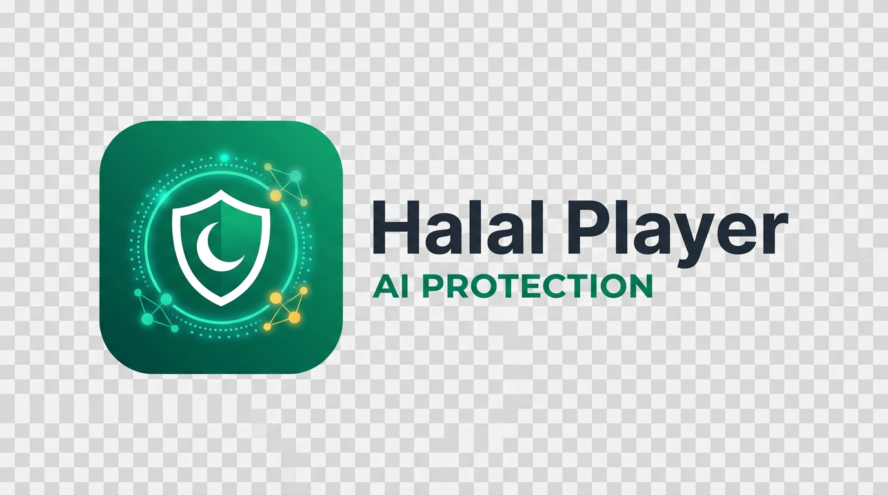
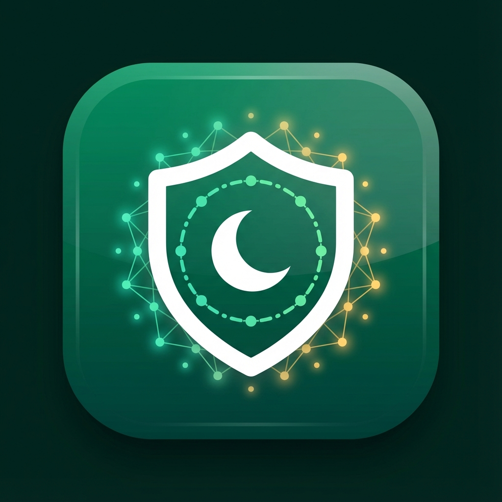

# 🎬 Halal Player

<p align="center">
  
</p>

<p align="center">
  <strong>Privacy-first media player with AI content filtering for Islamic compliance</strong>
</p>

<p align="center">
  
  
  
  
  
</p>

---

## ✨ Features

### 🛡️ AI Content Protection
- **5 Filtering Modes**: Strict Islamic, Family, Teen, Educational, Developer
- **On-Device AI**: NSFW detection using OpenNSFW2 & NudeNet
- **Real-time Analysis**: Frame-by-frame video scanning via FFmpeg and Python AI
- **Blur/Block Actions**: High-performance backdrop blur filter for flagged content
- **Islamic Subtitle Filter**: Built-in word list filtering with regex matches to censor profanity in subtitles

### 🎥 Media Players
- **Video Player**: Powered by media_kit with backdrop blur filter overlay, custom overlays, and subtitles integration
- **Audio Player**: just_audio with real waveform visualization (CustomPainter) and metadata extraction (Title/Artist/Album Art)
- **Image Viewer**: Real-time AI scanning before display with zoom and pan controls

### 🌍 Translation System
- **2 Languages**: English and Arabic
- **RTL Support**: Arabic
- **Auto Subtitles**: SRT, VTT, ASS format support
- **OpenSubtitles**: Auto-download by movie hash
- **AI Translation & STT**: Whisper STT (cloud/local) + Argos Translate (full offline python subprocess integration with language detection)
- **Translation Screen UI**: Comprehensive interface for file translation with real-time progress indicators and preview panels

### 🎨 Modern UI
- **Material 3 Design**: Beautiful dark/light themes
- **Keyboard Shortcuts**: Space (play/pause), F (fullscreen), M (mute), arrows (seek)
- **Recent Files**: Persistent dashboard showing last opened files with navigation

---

## 🎨 Brand Colors

| Color | Hex | Usage |
|-------|-----|-------|
| 🟢 Primary Green | `#4CAF50` | Buttons, accents, safe indicators |
| ⬛ Dark Background | `#1A1A1A` | Main background (dark mode) |
| 🔲 Dark Surface | `#2A2A2A` | Cards, panels |
| ⬜ Light Background | `#F5F5F5` | Main background (light mode) |
| ⚪ Light Surface | `#FFFFFF` | Cards, panels (light mode) |

---

## 🚀 Getting Started

### Prerequisites
- Flutter SDK 3.7+
- Windows 10/11
- **Windows Developer Mode Enabled** (required for plugin symlink support: `start ms-settings:developers`)
- Visual Studio with C++ tools
- Python 3.8+ (for offline AI and Translation modules)

### Installation

```bash
# Clone the repository
git clone https://github.com/ahmedfawzyjr/Halal-Player.git
cd Halal-Player

# Install dependencies
flutter pub get

# Install Python requirements (Optional, for offline AI/Translation)
pip install argostranslate langdetect openai-whisper

# Run the app
flutter run -d windows
```

### Build Release

```bash
flutter build windows --release
```

---

## 📂 Project Structure

```
lib/
├── main.dart              # App entry point & navigation setup
├── providers.dart         # Riverpod state management & Hive configs
├── core/                  # Config, themes, policy engine
├── modules/               # Video, audio, subtitles, translation modules
├── ai/                    # Frame & image analyzers, detectors
├── ui/                    # Home, settings, logs, translation screens
└── l10n/                  # 2 language files (ARB)

test/                      # Comprehensive test suite (41 tests)
├── core/                  # Policy engine and Islamic filter tests
├── modules/               # Subtitle parser and translator tests
└── ui/                    # Settings screen UI widget tests
```

---

## 🔧 Configuration & Setup

### AI Models (Optional)
Download and place in `assets/models/`:
- `nsfw.onnx` - OpenNSFW2 model
- `nudenet.onnx` - NudeNet model

### Whisper STT (Optional)
```bash
pip install openai-whisper
```

### Argos Translate (Optional)
```bash
pip install argostranslate langdetect
```

### Android Release & Keystore Configuration
For Google Play deployment, Android releases are signed using an upload keystore. 
1. The signing configuration is defined in the `android/key.properties` file.
2. The keystore is stored in `android/app/upload-keystore.jks`.
3. To configure your keys, create a `.env` file in the root directory (based on `.env.example`) to document your passwords:
```env
STORE_PASSWORD=your_store_password
KEY_PASSWORD=your_key_password
KEY_ALIAS=upload
STORE_FILE=upload-keystore.jks
```

Both `.env` and `android/key.properties` are listed in `.gitignore` to prevent committing credentials to source control.

---

## 🧪 Testing

The repository contains 41 tests verifying all major logical blocks (Policy Engine, Subtitle Parsers, Translation workflows, Islamic Filtering, and settings interface).

To run the automated tests:
```bash
flutter test
```

---

## 🔒 Privacy

- ✅ **100% Offline** - All AI and Argos translations run locally
- ✅ **No Cloud** - Your media never leaves your device
- ✅ **No Tracking** - Zero analytics or telemetry
- ✅ **Open Source** - Fully auditable code

---

## 🤝 Contributing

1. Fork the repository
2. Create your feature branch (`git checkout -b feature/AmazingFeature`)
3. Commit your changes (`git commit -m 'Add some AmazingFeature'`)
4. Push to the branch (`git push origin feature/AmazingFeature`)
5. Open a Pull Request

---

## 📄 License

MIT License - see [LICENSE](LICENSE) for details.

---

## 🙏 Acknowledgments

- [Flutter](https://flutter.dev)
- [media_kit](https://github.com/media-kit/media-kit)
- [OpenSubtitles](https://opensubtitles.com)
- [OpenAI Whisper](https://github.com/openai/whisper)
- [Argos Translate](https://github.com/argostranslate/argostranslate)

---

<p align="center">
  
  <br>
  Made with ❤️ for the Muslim community
</p>
