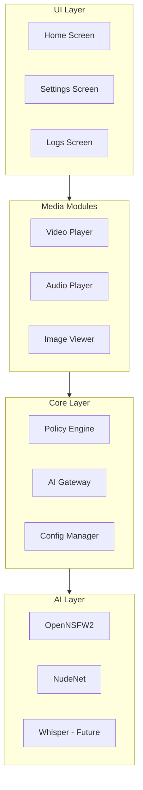
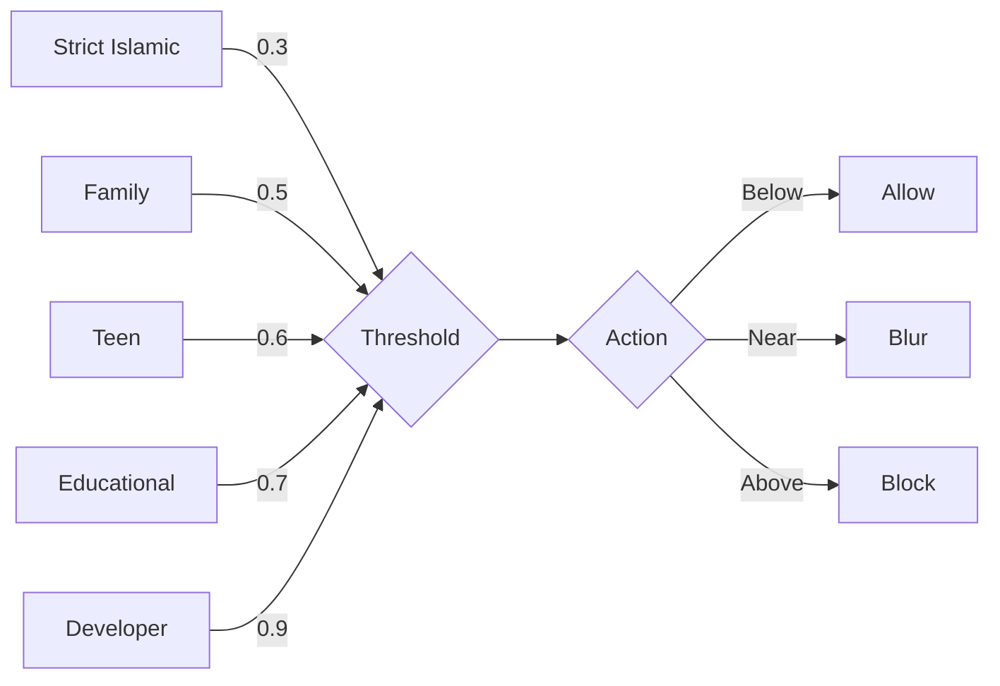

# Halal Player - Architecture Document

**Version**: 1.0  
**Platform**: Windows Desktop (Linux/Mac later)  
**Framework**: Flutter Desktop

---

## System Overview



---

## Component Architecture

### 1. Core Layer

#### Config Manager
```dart
class AppConfig {
  FilterMode mode;           // strict, family, teen, educational, dev
  double nsfwThreshold;      // 0.0 - 1.0
  double nudenetThreshold;   // 0.0 - 1.0
  bool enableLogging;
  bool showExplanations;     // AI Explain Mode
}
```

#### Policy Engine
Decision maker based on AI scores and user preferences.

```dart
enum ContentAction { allow, blur, block }

class PolicyEngine {
  ContentAction decide({
    required double nsfwScore,
    required double nudenetScore,
    required FilterMode mode,
  });
}
```

#### AI Gateway
Unified interface for all AI models.

```dart
abstract class AIDetector {
  Future<DetectionResult> analyze(Uint8List imageBytes);
}

class AIGateway {
  final NSFWDetector nsfw;
  final NudeNetDetector nudenet;
  
  Future<AggregatedResult> analyzeImage(Uint8List bytes);
  Future<AggregatedResult> analyzeFrame(VideoFrame frame);
}
```

---

### 2. Media Modules

#### Video Player
| Component | Responsibility |
|-----------|---------------|
| VideoPlayerScreen | UI, controls, blur overlay |
| VideoPlayerController | Playback, seek, volume |
| FrameAnalyzer | Extract frames at intervals |

**Frame Analysis Strategy**:
- Extract 1 frame/second during playback
- Run AI on background isolate
- Cache results per timestamp
- If flagged → blur/pause

#### Audio Player
| Component | Responsibility |
|-----------|---------------|
| AudioPlayerScreen | UI, waveform visualization |
| AudioPlayerController | Playback controls |

**Future**: Whisper STT + Text Moderation

#### Image Viewer
| Component | Responsibility |
|-----------|---------------|
| ImageViewerScreen | Display, zoom, pan |
| ImageAnalyzer | Pre-display AI check |

---

### 3. AI Layer

#### OpenNSFW2
- **Input**: 224x224 RGB image
- **Output**: NSFW probability (0.0 - 1.0)
- **Runtime**: ONNX

#### NudeNet
- **Input**: Variable size image
- **Output**: Body part classifications with scores
- **Runtime**: ONNX

#### Score Aggregation
```dart
double aggregateScore(double nsfw, double nudenet) {
  return max(nsfw, nudenet * 0.8); // Weight nudenet slightly lower
}
```

---

## Privacy by Design

| Principle | Implementation |
|-----------|---------------|
| 100% Offline | All AI runs locally, no network calls |
| No Cloud Upload | Media never leaves device |
| No Forced Logging | Logging is optional, user-controlled |
| AI Explain Mode | User sees why content was flagged |
| Consent-Based | Telemetry requires explicit opt-in |
| Data Ownership | All logs stored locally, user can delete |

---

## Filtering Modes



---

## Data Flow

### Image Loading
```
User selects image
    ↓
Load image bytes
    ↓
AI Gateway.analyzeImage()
    ↓
[OpenNSFW2] + [NudeNet] (parallel)
    ↓
Score Aggregation
    ↓
Policy Engine.decide()
    ↓
Allow → Display
Blur → Display with blur overlay
Block → Show blocked message + log
```

### Video Playback
```
User plays video
    ↓
Start playback
    ↓
FrameAnalyzer extracts frames (1/sec)
    ↓
AI analysis on Isolate (non-blocking)
    ↓
If flagged:
    - Blur current frame
    - Optional: Pause + warning
    ↓
Resume when safe
```

---

## Directory Structure

```
E:\Halal Player\
├── lib/
│   ├── main.dart
│   ├── app.dart
│   │
│   ├── core/
│   │   ├── config.dart
│   │   ├── policy_engine.dart
│   │   └── ai_gateway.dart
│   │
│   ├── modules/
│   │   ├── video_player/
│   │   ├── audio_player/
│   │   └── image_viewer/
│   │
│   ├── ai/
│   │   ├── nsfw/
│   │   └── nudenet/
│   │
│   └── ui/
│       ├── home/
│       ├── settings/
│       └── logs/
│
├── assets/
│   └── models/
│       ├── nsfw.onnx
│       └── nudenet.onnx
│
├── windows/
└── pubspec.yaml
```

---

## Tech Stack Summary

| Layer | Technology |
|-------|------------|
| UI Framework | Flutter Desktop |
| UI Components | Fluent UI (Windows native) |
| Video | media_kit |
| Audio | just_audio |
| AI Runtime | ONNX Runtime (Dart FFI) |
| State Management | Riverpod |
| Storage | Hive |
| Window | window_manager |
